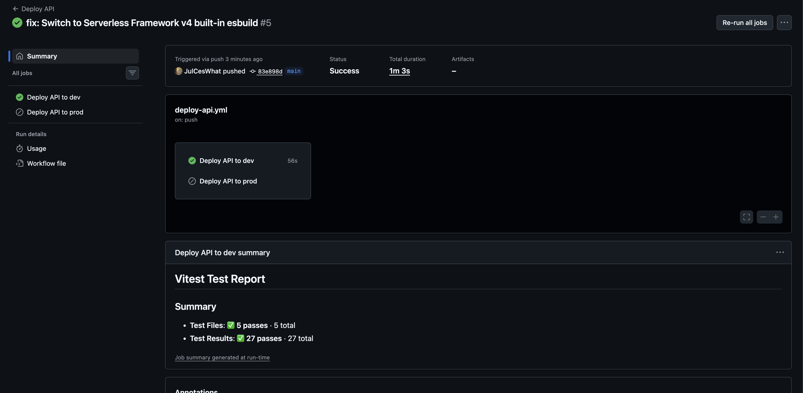

# Todo App

A full-stack serverless todo application built with AWS Lambda, API Gateway, DynamoDB, and React.

## Live URLs

| Environment | URL |
|---|---|
| Frontend | https://julceswhat.github.io/ToDo-App/ |
| API | https://m9rq0ko1rh.execute-api.us-east-1.amazonaws.com/dev/todos |

---

## Architecture

```
React (GitHub Pages)
    ↓  HTTPS + JWT
API Gateway
    ↓
Lambda Functions (Node.js 20)
    ↓
DynamoDB
```

Authentication is handled by **AWS Cognito** — users sign up/log in via the React frontend, and Cognito JWTs are validated by API Gateway before any Lambda function runs.

---

## Project Structure

```
ToDo-App/
├── .github/workflows/
│   ├── deploy-api.yml          # Deploys backend to AWS (dev on push, prod on manual)
│   └── deploy-frontend.yml     # Deploys frontend to GitHub Pages on push to main
├── src/todos/
│   ├── create.mjs              # POST /todos
│   ├── list.mjs                # GET /todos
│   ├── get.mjs                 # GET /todos/{id}
│   ├── update.mjs              # PUT /todos/{id}
│   ├── delete.mjs              # DELETE /todos/{id}
│   └── __tests__/              # Unit tests (Vitest)
│       ├── create.test.mjs
│       ├── list.test.mjs
│       ├── get.test.mjs
│       ├── update.test.mjs
│       └── delete.test.mjs
├── functions/
│   └── todos.yml               # Lambda function definitions
├── resources/
│   ├── cognito.yml             # Cognito User Pool & Authorizer
│   └── dynamodb.yml            # DynamoDB table definition
├── frontend/
│   └── src/
│       ├── App.jsx             # Main UI with auth + todo management
│       ├── api.js              # API calls with Authorization header
│       ├── auth.js             # Cognito sign in/up/out helpers
│       └── test/               # Frontend UI tests (Vitest + RTL)
├── serverless.yml              # Main AWS infrastructure config
├── vitest.config.js            # Backend test config
└── package.json                # Backend dependencies
```

---

## Requirements

### Local Development
- [Node.js](https://nodejs.org) v20+
- [AWS CLI](https://aws.amazon.com/cli/) configured (`aws configure`)
- [Serverless Framework](https://www.serverless.com) v4

---

## Local Setup

### 1. Install backend dependencies

```bash
npm install
```

### 2. Start the local API server

```bash
npm run dev
# API available at http://localhost:3000
```

> Note: `serverless offline` runs Lambda functions locally but calls real AWS DynamoDB. Ensure your AWS credentials are configured and the stack has been deployed at least once to create the table.

### 3. Install frontend dependencies

```bash
cd frontend && npm install
```

### 4. Configure frontend environment

Create `frontend/.env.local`:

```
VITE_API_URL=http://localhost:3000/todos
VITE_USER_POOL_ID=us-east-1_XXXXXXXXX
VITE_USER_POOL_CLIENT_ID=XXXXXXXXXXXXXXXXXXXXXXXXXX
```

Get the Cognito values after deploying (see Deployment below).

### 5. Start the frontend

```bash
cd frontend && npm run dev
# App available at http://localhost:5173
```

---

## CI/CD (GitHub Actions)



Two pipelines run automatically on push to `main`:

| Pipeline | Trigger | What it does |
|---|---|---|
| `deploy-api.yml` | Changes to `src/**`, `serverless.yml`, `package.json` | Runs backend tests, then deploys to AWS |
| `deploy-frontend.yml` | Changes to `frontend/**` | Runs frontend tests, builds React app, deploys to GitHub Pages |

Both pipelines run unit tests before deploying — a failing test will block the deploy.

A **manual deploy to prod** button is available in the API pipeline via `workflow_dispatch`.

## API Endpoints

All endpoints require a Cognito JWT passed as `Authorization: <token>` header.

| Method | Path | Description |
|---|---|---|
| `GET` | `/todos` | List all todos |
| `POST` | `/todos` | Create a todo — body: `{ "text": "..." }` |
| `GET` | `/todos/{id}` | Get a single todo |
| `PUT` | `/todos/{id}` | Update a todo — body: `{ "text": "...", "checked": true }` |
| `DELETE` | `/todos/{id}` | Delete a todo |

---

## Tech Stack

| Layer | Technology |
|---|---|
| Frontend | React 18, Vite, Tailwind CSS v4 |
| Auth | AWS Cognito (User Pools) |
| API | AWS API Gateway (REST) |
| Compute | AWS Lambda (Node.js 20, ESM) |
| Database | AWS DynamoDB (on-demand, user-scoped) |
| Bundling | esbuild (via serverless-esbuild) |
| IaC | Serverless Framework v4 |
| Testing | Vitest, React Testing Library |
| CI/CD | GitHub Actions |
| Hosting | GitHub Pages |

---

## Testing

### Backend (27 tests)

```bash
npm test          # single run
npm run test:watch # watch mode
```

### Frontend (17 tests)

```bash
cd frontend && npm test
```
